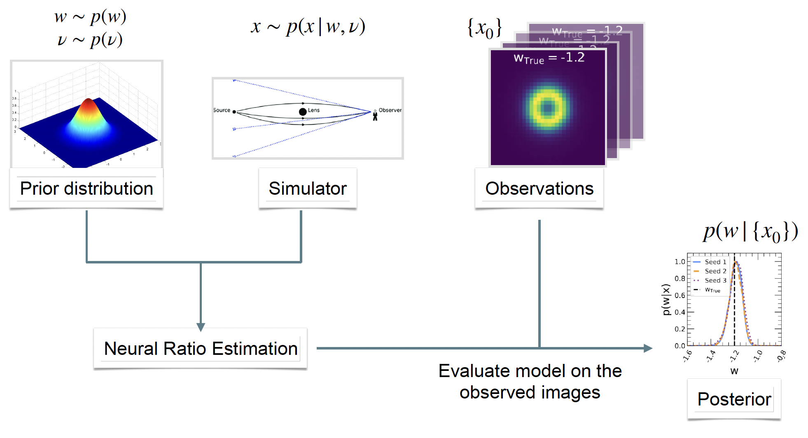

We present **DeepCosmoSLIDE**: a **S**trong **L**ens based **I**nference for **D**ark **E**nergy. We use Simulation Based Inference (SBI) with Neural Ratio Estimation (NRE) to constrain Dark Energy parameter from a population of strong galaxy-galaxy lenses.

## Introduction 

Strong gravitational lensing offers crucial insights into cosmology, but traditional Monte Carlo methods for cosmological inference are computationally prohibitive and inadequate for processing the thousands of lenses anticipated from future cosmic surveys. New tools for inference, such as SBI using NRE, address this challenge effectively. NRE is a classifier neural network to differentiate between two probability distributions: 

$(x,w) \sim\ p(x,w)$ with class label y=1

$(x,w) \sim\ p(x)p(w)$ with class label y=0

where $x$ is the strong lens image and $w$ is the dark energy equation-of-state parameter that generated the image.

By training a machine learning model on simulated data of strong lenses, we can learn the likelihood-to-evidence ratio $\frac{p(x|w)}{p(x)}$. This is used for robust inference of the posterior $p(w|\{x_{0}\})$ from a population of strong lens images $\{x_{0}\}$.

$\textbf{Analysis Workflow}$

The following figure summarizes the workflow of the analysis. 

The strong lens images are genereated using a simulator where the parameters are sampled from a prior distribution. The training data for the NRE network (classifier) includes the image and the parameter of interest. The network outputs the likelihood-to-evidence ratio. The trained model is implemented on the observations to estimate the posterior.

## Getting started

### Data

The data used for this analysis can be found on Zenodo (link will be provided shortly).

The images are generated using [Deeplenstronomy](https://github.com/deepskies/deeplenstronomy) package.

This data can be generated using the yaml files in `/deeplenstornomy_templates` as inputs to $\texttt{Deeplenstronomy}$.

The simulation outputs the data into a folder which includes images (`/CONFIGURATION_1_images.npy`) and the metadata (`/CONFIGURATION_1_metadata.csv`) assocated with the image generation. 

$\textbf{Training data}$
We train, validate, and test the NRE model on simulated data of 1M strong lens images. 

$\textbf{Test data for population-level analysis}$
We generate three datasets of 3000 images each by fixing w = -1.2, -1.0, and -0.8 respectively. 

<!-- #### Architecture
The network is a ResNet architecture to classify between two classes. We train the network by minimizing the Brinay Cross Entropy (BCE) loss function by dynamically adjusting the learning rate when the vali-
dation loss is plateaued by a decay factor of 0.1 starting
from $1e^{−2}$ to $1e^{−6}$, if the validation loss does not improve
over five epochs. We include an option for early stopping if the validation loss does not improve over 20 epochs. The model is trained on NVIDIA A100 GPU for 71 epochs with a typical training time of 25
minutes. -->

### Notebooks for analysis

The notebooks in `/notebooks` can be run to reproduce the results of the paper. The python scripts are currently being developed to be run from the terminal.

$\textbf{Model Training}$ 

`train_model.ipynb`
This notebook includes reading in the data, preprocessing of the images, 
and training the model. 
Three models with random weight initializations (`seed` input to the model) are run in our analysis to check robustness. One of the models `working_model_1M-2-034_seed128_v2.keras` is available on Zonodo (link will be provided shortly).

This trained model can be directly loaded (without having to re-train the model) using 

`model = tf.keras.models.load_model(model_name)`

$\textbf{Model Evaluation}$ 

`compare_random_seeds.ipynb` code is for checking the performance of the model on test data of 2000 images.
The code includes plotting the Receiver Operating Curve (ROC) for the three models. It also includes calculating and plotting the analytical posteriors of a few randomly selected strong lenses.

`plot_image_posterior.ipynb` code is for plotting the training data and show the correlation between the Einstein radius and $w$. This code also plots the image of strong lens from the training data and the corresponing analytical posterior.

`plot_residuals` is to plot the predicted mean $w$ of the analytical posterior with 1 $\sigma$ error bar Vs the true $w$ of the 2000 test images. We also compute the posterior coverage plot to check the model uncertainity. 

$\textbf{Population-level Analysis}$

`NRE_varyastro_w12.ipynb`, `NRE_varyastro_w1.ipynb`, and `NRE_varyastro_w08.ipynb` include functions to compute the joint posterior from 3000 images with $w$ fixed to -1.2, -1.0, and -0.8 respectively. We show both MCMC and analytical methods to calculate the posterior.

`Compare_mcmc_analytical.ipynb` compares the posteriors from the MCMC and analytical methods.

### Authors

Sreevani Jarugula

### References

If you use this code, please cite our paper (Link to be posted shortly)

 

